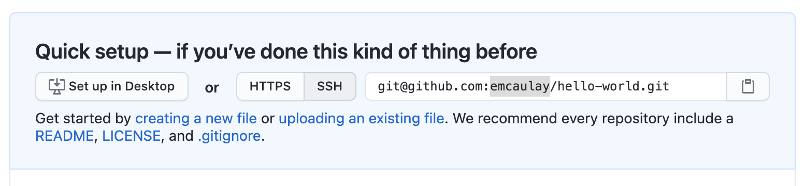

## Create a repository on GitHub

When we have logged in to GitHub, we can create a new repository by clicking the **+** icon in the upper-right corner of
any page then selecting **New repository**. Let's do this now.

* Create a new repository
* Give it the name `hello-world`

GitHub will ask if you want to add a README.md, license or a `.gitignore` file. Do not do any of that for now.

> ## Choosing a license
> Choosing a license is an important part of openly sharing your creative work online. For help in wading through the
> many types of open source licenses, please visit <https://choosealicense.com/>.
{: .callout}

## Connecting your local repository to the GitHub repository

In the previous episode we created a local repository on our own computer.
Now we have also created a remote repository on GitHub.
But at this point, the two are completely isolated from each other.
We want to link them together to synchronize them and share our project with the world.

To do this, we need the GitHub repository URL, which should look something like this
(with "some-librarian" replaced with your username):

If the URL starts with `git@` rather than `https://`, please click the "HTTPS" button to change it.

> ## HTTPS vs. SSH
>
> We use HTTPS here because it does not require additional configuration, which vary
> from operating system to operating system. If you start using Git regularly, you would
> like to set up SSH access, which is a bit more secure and convenient, by
> following one of the great tutorials from
> [GitHub](https://help.github.com/articles/generating-ssh-keys),
> [Atlassian/BitBucket](https://confluence.atlassian.com/display/BITBUCKET/Set+up+SSH+for+Git)
> and [GitLab](https://about.gitlab.com/2014/03/04/add-ssh-key-screencast/)
> (this one has a screencast).
{: .callout}

Notice that GitHub is actually helpful enough to provide instructions for us
so we don't have to remember these commands:

You can therefore choose to copy these and paste them on the command line.
Or you can choose to type them out to get them into your fingers.
I will do that. So we start with the command to link our local repository
to the GitHub repository:

~~~
$ git remote add origin https://github.com/some-librarian/hello-world.git
~~~
{: .bash}

where `some-librarian` should be replaced with your own username.

> ## Why `origin`?
> `origin` in the `git remote add` line is just a short name or alias we're giving to that big long repository URL.
> It could be almost any string we want, but by convention in git, it is usually called `origin`, representing where
> the repo originated.
{: .callout}

We can check that it is set up correctly with the command:

~~~
$ git remote -v
~~~
{: .bash}
~~~
origin  https://github.com/<your_github_username>/hello-world (fetch)
origin  https://github.com/<your_github_username>/hello-world (push)
~~~
{: .output}

## Pushing changes

Now we have established a connection between the two repositories, but we still haven't
synchronized their content, so the remote repository is still empty. To fix that, we
will have to "push" our local changes to the GitHub repository. We do this using the
`git push` command:

~~~
$ git push origin master
~~~
{: .bash}
~~~
Counting objects: 3, done.
Writing objects: 100% (3/3), 226 bytes | 0 bytes/s, done.
Total 3 (delta 0), reused 0 (delta 0)
To https://github.com/<your_github_username/hello-world
 * [new branch]      master -> master
Branch master set up to track remote branch master from origin.
PS C:\github\hello-world> git status
On branch master
Your branch is up-to-date with 'origin/master'.
nothing to commit, working tree clean
~~~
{: .output}

The nickname of our remote repository is "origin" and the default local branch name is "master".
The `-u` flag tells git to remember the parameters, so that next time we can simply run `git push`
and Git will know what to do.

You may be prompted to enter your GitHub username and password to complete the command.

When we do a `git push`, we will see Git 'pushing' changes upstream to GitHub. Because our file is very small, this 
won't take long but if we had made a lot of changes or were adding a very large repository, we might have to wait a 
little longer. We can check where we're at with `git status`.

~~~
$ git status
~~~
{: .bash}
~~~
On branch master
Your branch is up-to-date with 'origin/master'.
nothing to commit, working tree clean
~~~
{: .output}

This output lets us know where we are working (the master branch). We can also see that we have no changes to commit 
and everything is in order.

We can use the `git diff` command to see changes we have made before making a commit. Open index.md with any text 
editor and enter some text on a new line, for instance "A new line" or something else.
We will then use `git diff` to see the changes we made:

~~~
$ git diff
~~~
{: .bash}
~~~
diff --git a/index.md b/index.md
index aed0629..989787e 100644
--- a/index.md
+++ b/index.md
@@ -1 +1,2 @@
-# Hello, world!
\ No newline at end of file
+# Hello, world!
+A new line
~~~
{: .output}

The command produces lots of informatinon and it can be a bit overwhelming at first,
but let's go through some key information here:

1. The first line tells us that Git is producing output similar to the Unix `diff` command, comparing the old and new 
versions of the file.
2. The second line tells exactly which versions of the file Git is comparing; `aed0629` and `989787e` are unique 
computer-generated identifiers for those versions.
3. The third and fourth lines once again show the name of the file being changed.
4. The remaining lines are the most interesting; they show us the actual differences and the lines on which they occur. 
In particular, the + markers in the first column show where we have added lines.

We can now commit these changes:

~~~
$ git add index.md
$ git commit -m 'Add another line'
~~~
{: .bash}

If we are very forgetful and have already forgotten what we changes we have made, `git log` allows us to look at what 
we have been doing with our git repository (in reverse chronological order, with the very latest changes first).

~~~
$ git log
~~~
{: .bash}
~~~
commit 8e2eb9920eaa0bf18a4adfa12474ad58b765fd06
Author: Your Name <your_email>
Date:   Mon Jun 5 12:41:45 2017 +0100

    Add another line

commit e9e8fd3f12b64fc3cbe8533e321ef2cdb1f4ed39
Author: Your Name <your_email>
Date:   Fri Jun 2 18:15:43 2017 +0100

    Add index.md
~~~
{: .output}

This shows us the two commits we have made and shows the messages we wrote. It is important to try to use meaningful 
commit messages when we make changes. This is especially important when we are working with other people who might not 
be able to guess as easily what our short cryptic messages might mean. Note that it is best practice to always write 
commit messages in the imperative (e.g. 'Add index.md', rather than 'Adding index.md').

## Pushing changes (again)

Now, let's have a look at the repository at GitHub again
(that is, `https://github.com/some-librarian/hello-world` with `some-librarian` replaced with your username).
We see that the `index.md` file is there, but there is only one commit:

And if you click on `index.md` you will see that it contains the "Hello, world!" header,
but not the new line we just added.

This is because we haven't yet pushed our local changes to the remote repository.
This might seem like a mistake in design but it is 
often useful to make a lot of commits for small changes so you are able to make careful revisions later and you don't 
necessarily want to push all these changes one by one.

Another benefit of this design is that you can make commits without being connected to internet.

But let's push our changes now, using the `git push` command:

~~~
$ git push
~~~
{: .bash}
~~~
Counting objects: 3, done.
Writing objects: 100% (3/3), 272 bytes | 0 bytes/s, done.
Total 3 (delta 0), reused 0 (delta 0)
To https://github.com/<your_github_username>/hello-world
   e9e8fd3..8e2eb99  master -> master
~~~
{: .output}

And let's check on GitHub that we now have 2 commits there.

## Pulling changes

When working with others, or when we're making our own changes from different machines, we need a way of pulling those
remote changes back into our local copy. For now, we can see how this works by making a change on the GitHub website and 
then 'pulling' that change back to our computer.

Let's go to our repository in GitHub and make a change. Underneath where our index.md file is listed you will see a 
button to 'Add a README'. Do this now, entering whatever you like, scrolling to the bottom and clicking 'Commit new 
file' (The default commit message will be 'Create README.md', which is fine for our purposes).

> ## The README file
> It is good practice to add a README file to each project to give a brief overview of what the project is about. If you 
> put your README file in your repository's root directory, GitHub will recognize and automatically surface your README 
> to repository visitors
{: .callout}

Our local repository is now out of sync with our remote repository, so let's fix that by pulling the remote changes into
our local repository using the `git pull` command.

~~~
$ git pull
~~~
{: .bash}
~~~
remote: Counting objects: 3, done.
remote: Compressing objects: 100% (2/2), done.
remote: Total 3 (delta 0), reused 0 (delta 0), pack-reused 0
Unpacking objects: 100% (3/3), done.
From https://github.com/<your_github_username>/hello-world
   8e2eb99..0f5a7b0  master     -> origin/master
Updating 8e2eb99..0f5a7b0
Fast-forward
 README.md | 1 +
 1 file changed, 1 insertion(+)
 create mode 100644 README.md
~~~
{: .output}

The above output shows that we have fast-forwarded our local repository to include the file README.md. We could confirm
this by entering the `ls` command.

When we begin collaborating on more complex projects, we may have to consider more aspects of git functionality, but 
this should be a good start. In the next section, we can look more closely at collaborating and using GitHub pages to
create a website for our project.
