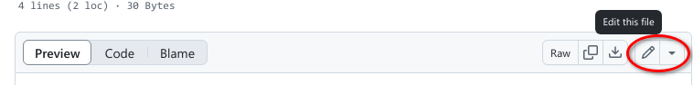

## GitHub Pages

GitHub Pages is a simple service to publish a website directly on GitHub from a Git repository.
You add some files and folders to a repository and GitHub Pages turns it into a website.
You can use HTML directly if you like, but they also provide Jekyll,
which renders Markdown into HTML and makes it really easy to setup a blog or a template-based website.

### Why GitHub Pages is awesome!

GitHub Pages allows you to version control your website. This is useful for a lot of different reasons. It allows you to 
keep a record of what changes you have made. It allows people to reference your website at a particular point in time 
and (if you make your source open) to see what it was like at that particular point in time. This is very useful for 
academic citations. Most people have had the experience of following up a reference to a website and either getting a 
404 error or seeing something completely different. Although using versions on your site doesn't guarantee this won't 
happen, it does make it easier to manage old versions of your site.

GitHub Pages also mean that you can collaborate on a website with a lot of people without everyone having to 
communicate endlessly back and forwards about what changes need to be made, or have been made already. You can create 
'issues' (things that need discussing or fixing), list things to do in the future, and allow other people visiting your 
website to quickly suggest, and help implement changes through pull requests.

### Setting up a site

Now we're all persuaded of how awesome GitHub Pages is (or you've identified some fatal flaws in my reasoning), it 
would be useful to try playing around with some things we can do with it. This will help us cement what we 
have learned in the previous hour and may help spark discussion for the last section of this session.

There are various options for setting up a GitHub Pages site. Let's run through a few of them now.

### The gh-pages branch

GitHub Pages uses a special branch in your GitHub repository to look for website content,
and by default this is the branch with the name 'gh-pages'.
You can actually change this, under repository settings, to use for instance the master branch instead,
but let's stick with the default for now.

It's possible to create a new branch directly on GitHub, but we will use the command line now.
So we will move back to the command line and type

~~~
$ git checkout -b gh-pages
$ git push
~~~
{: .bash}
~~~
fatal: The current branch gh-pages has no upstream branch.
To push the current branch and set the remote as upstream, use

    git push --set-upstream origin gh-pages
~~~
{: .output}

Ouch, that didn't go as we wanted, we got a fatal error!
Let's see what Git tells us.
It says that it doesn't know where it should push the changes.
But it's also friendly enough to tell us what we most likely want to do,
which is to push to the `gh-pages` branch at "origin"
(remember that "origin" in our case is just a nickname for our GitHub repository).

So let's do that:

~~~
$ git push --set-upstream origin gh-pages
~~~
{: .bash}
~~~
Total 0 (delta 0), reused 0 (delta 0)
To https://github.com/danmichaelo/hello-world.git
 * [new branch]      gh-pages -> gh-pages
Branch gh-pages set up to track remote branch gh-pages from origin.
~~~
{: .output}

You might remember from earlier that we did `git push -u origin master` to
set up the master branch. The `-u` is a shorthand for `--set-upstream`, so
above you could also have typed `git push -u origin gh-pages`.

And remember, we only have to do this the first time we push to a new branch.
The next time we can just do `git push`.

### View your site

If we now visit `https://some-librarian.github.io/hello-world/`,
we should see the contents of the index.md file that created earlier.
Usually it's available instantly, but it can take a few seconds and in the worst case a few minutes if GitHub are very busy.

> ## Challenge: Contributing to a page owned by someone else (slightly easier way)
>
> To practice using Git, GitHub pages and Markdown we can contribute to a GitHub pages site.
> Pair up in groups of two (or more if needed) and do the exercises below together.
> 
> 1. Go to https://github.com/some-librarian/hello-world, where "some-librarian" is the username of your exercise partner.
> 2. Click on "Fork" in the upper right part of the screen to create a copy of the repository on your account. Once you have a fork > of your partner's repository, you can edit the files in your own fork directly.
> 3. Click the "index.md" file, then click the edit pencil icon:
> 
>    
> 
> 4. Now is good chance to try some Markdown syntax.
>    Try some of the examples at [Mastering Markdown](https://guides.github.com/features/mastering-markdown/).
>    You can preview how it will look before you commit changes.
> 5. Once you are ready to commit, enter a short commit message,
>    select "Create a new branch for this commit and start a pull request"
>    and press "Propose file change" to avoid commiting directly to the master branch.
> 
>    
> 
> 8. You can now go to the repository on your account and click "New Pull Request" button, 
>    where you can select base branches repositories, review the changes and add an additional
>    explanation before sending the pull request (this is especially useful
>    if you make a single pull request for multiple commits).
> 9. Your partner should now see a pull request under the "Pull requests" tab
>    and can accept ("Merge pull request") the changes there. Try this.
> 
> This whole process of making a fork and a pull request might seem a bit cumbersome.
> Try to think of why it was needed? And why it's called "pull request"?
>
> > ## Solution
> > We made a fork and a pull request because we did not have permission to edit
> > (or commit) the repository directly. A fork is a copy of the repository that
> > we *can* edit. By making a pull request we ask the owner of the repository if
> > they would like to accept (pull in) the changes from our fork (our copy) into
> > their version. The owner can then review the changes and choose to accept or
> > reject them.
> >
> > You can open pull requests on any repository you find on GitHub. If you are a
> > group of people who plan to collaborate closely, on the other hand,
> > it's more practical to grant everyone access to commit directly instead.
> >
> {: .solution}
{: .challenge}

> ## Optional challenge: Contributing to a page owned by someone else (slightly more complicated way)
>
> Instead of making edits on the GitHub website you can 'clone' the fork to your local machine
> and work there.
>
> Try following the rest of the steps under "Time to Submit Your First PR"
> at this guide: <https://www.thinkful.com/learn/github-pull-request-tutorial/Writing-a-Good-Commit-Message#Time-to-Submit-Your-First-PR>
>
> (If you followed step 1 and 2 in the previous challenge, you already have a fork and you can
> skip the creation of a new fork if you like. You can submit multiple pull requests using the same fork.)
>
{: .challenge}

> ## Optional challenge: Adding an HTML page
>
> GitHub Pages is not limited to Markdown. If you know some HTML, try adding an HTML page
> to your repository. You could do this on the command line or directly on GitHub. The
> steps below are for working directly on GitHub:
>
> 1. Make sure you are working on the "gh-pages" branch. Select it from the menu if not:
>
>    
>
> 2. To add a new file directly on GitHub, press the "Create new file" button. 
>
>    
>
> 3. Name it 'test.html', add some HTML and click "Commit new file".
> 4. Try opening `https://some-librarian.github.io/hello-world/test`
>    (replace "some-librarian" with your username).
>    Notice that the HTML extension is not included.
>
{: .challenge}
