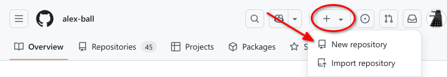
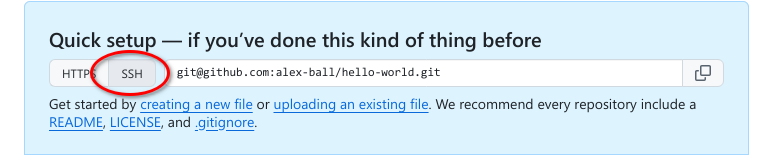
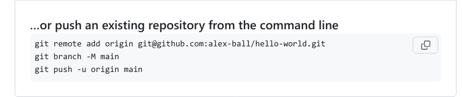
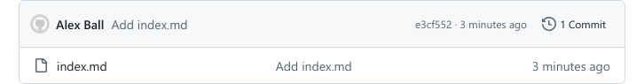

::::::::::::::::::::::::::::::::::::::: objectives

- create a remote repository on GitHub
- link a local Git repository to a remote GitHub repository
- move changes between the local and remote repositories using `push` and `pull`
- examine the difference between an edited file and the file's most recently committed version

::::::::::::::::::::::::::::::::::::::::::::::::::

:::::::::::::::::::::::::::::::::::::::: questions

- How can I use Git and GitHub to share my work?
- How do I link a local Git repository to GitHub?
- How do I move changes between a local Git repository and a GitHub repository?
- How can I see the differences between my current file and my most recent commit?

::::::::::::::::::::::::::::::::::::::::::::::::::

## The power of sharing

The real power of Git lies in being able to share your work with others and in being able to work collaboratively. The best way to do this is to use a remote hosting platform. For this lesson, we are using GitHub. Let's log in there now.

## Create a repository on GitHub

Once we have logged in to GitHub, we can create a new repository by clicking the **\+** icon in the upper-right corner of
any page then selecting **New repository**. Let's do this now.

{alt="The GitHub website top navigation with the 'add new ...' button."}

- Click "New Repository"

Clicking `New Repository` will take you to a creation page with different options. For this workshop, we are not using any of the options available.

- Name your repository "hello-world."

{alt="The 'create a new repository' form on GitHub" .image-with-shadow }

GitHub will ask if you want to add a README.md, license or a `.gitignore` file. Do not do any of that for now -- We want you to start with a completely empty repository on GitHub.

- Click `Create Repository` button.

:::::::::::::::::::::::::::::::::::::::::  callout

## Choosing a license

When you are ready to use GitHub to host your own work, you should review the different license options. Choosing a license is an important part of openly sharing your creative and research  work online. For help in wading through the
many types of open source licenses, please visit [https://choosealicense.com/](https://choosealicense.com/).


::::::::::::::::::::::::::::::::::::::::::::::::::

## Connecting your local repository to the GitHub repository

The next page that GitHub displays contains some information to help you connect your repository on GitHub with your local repository (on your own computer). To make this connection, we want to tell our local repository that GitHub is the `remote` repository. In order to do that we need the information that GitHub displays in the "Quick setup" box on this page.

We will use the Secure Shell (SSH) protocol for this lesson, so please make sure that button shows that it is selected (gray highlight) and that the address in the text box starts with git@github. It will look something like this:

{alt="The repository set up page in GitHub showing the SSH address to use."}

:::::::::::::::::::::::::::::::::::::::::  callout

## HTTPS vs. SSH

We use SSH here because, while it requires some additional configuration, it is a
security protocol widely used by many applications.  The steps below describe SSH at a
minimum level for GitHub.


::::::::::::::::::::::::::::::::::::::::::::::::::

<!--- A supplemental episode to this lesson discusses advanced setup, concepts of SSH and key pairs, and other material supplemental to git related SSH.--->

In the previous episode we created a local repository on our own computer.
Now we have also created a remote repository on GitHub.
But at this point, the two are completely isolated from each other.
We want to link them together to synchronize them and share our project with the world.

To connect the repository on our own computer (local) to the repository we just created on GitHub, we will use the commands provided by GitHub in the box with the heading "...or push an existing repository from the command line."

{alt="GitHub instructions"}

Let's use these instructions now. Move back to your shell application and enter the first command:

```bash 
$ git remote add origin git@github.com:yourname/hello-world.git 
```

Make sure to use the URL for your actual repository user name rather than `yourname`: the only
difference should be your username instead of `yourname`.

Let's breakdown the elements of the command. All commands related to Git in the shell start by invoking the Git language by typing `git` at the start.
`remote add` is the command in the Git language we use to configure a remote repository, e.g., another Git repository that contains the same content as our local repository, but that is not on our computer.
`origin` is the nickname we're telling our local machine to use to for the following long web address. After we enter this command, we can use `origin` to refer to this specific repository in GitHub instead of the URL.

We can check that it is set up correctly with the command:

```bash 
$ git remote -v
```

```output
origin  git@github.com:<your_github_username>/hello-world.git (fetch)
origin  git@github.com:<your_github_username>/hello-world.git (push)
```

## SSH Background and Setup

We still need to do a little more setup before we can actually connect to this remote repository.
We need to set up a way for our local computer to authenticate with GitHub so that GitHub recognizes our computer as belonging to the same person who owns the GitHub repository.

We will use SSH as our authentication method. SSH stands for Secure SHell protocol.  SSH is a cryptographic network protocol that allows secure communication between computers using an otherwise insecure network.

SSH uses what is called a key pair -- two keys that work together to validate access. One key is used publicly (the public key) and the other key is kept private (the private key).

You can think of the public key as a padlock, and only you have the key (the private key) to open it. You use the public key where you want a secure method of communication, such as your GitHub account.  You give this padlock, or public key, to GitHub and say "lock the communications to my account with this so that only computers that have my private key can unlock communications and send Git commands as my GitHub account."

What we will do now is the minimum required to set up the SSH keys and add the public key to a GitHub account.
I'm not going to lie, this is a bit tedious and confusing. But you have to do it to get to the fun part, so hang in there.

<!-- > ## Advanced SSH -->

<!-- > A supplemental episode in this lesson discusses SSH and key pairs in more depth and detail.-->

<!-- {: .callout}-->

The first thing we are going to do is check if this has already been done on the computer you're on.

:::::::::::::::::::::::::::::::::::::::::  callout

## Keeping your keys secure

You shouldn't really forget about your SSH keys, since they keep your account secure. It's good
practice to audit your secure shell keys every so often. Especially if you are using multiple
computers to access your account.


::::::::::::::::::::::::::::::::::::::::::::::::::

We will run the list command (`ls`) to check what key pairs already exist on your computer.
In our command we use the `~` as the shorthand for "my home directory."

```bash
ls -al ~/.ssh
```

Your output is going to look a little different depending on whether or not SSH has ever been set up on the computer you are using.

If you have not set up SSH, your output might look like this:

```output
ls: cannot access '/c/Users/YourName/.ssh': No such file or directory
```

If SSH has been set up on the computer you're using, the public and private key pairs will be listed. The file names are either `id_ed25519`/`id_ed25519.pub` or `id_rsa`/`id_rsa.pub` depending on how the key pairs were set up.

If you do not have SSH set up, let's set it up now. Use this command to create key pairs:

```bash
$ ssh-keygen -t ed25519 -C "yourname@domain.name"
```

```output
Generating public/private ed25519 key pair.
Enter file in which to save the key (/c/Users/YourName/.ssh/id_ed25519):
```

We want to use the default file, so just press <kbd>Enter</kbd>.

```output
Created directory '/c/Users/YourName/.ssh'.
Enter passphrase (empty for no passphrase):
```

Your computer is now asking you for a passphrase to protect this SSH key pair. We recommend that you use a passphrase and that you make a note of it. There is no "reset my password" option for this setup. If you forget your passphrase, you have to delete your existing key pair and do this setup again. It's not a big deal, but easier if you don't have to repeat it.

```output
Enter same passphrase again:
```

After entering the same passphrase a second time, you will receive the confirmation

```output
Your identification has been saved in /c/Users/YourName/.ssh/id_ed25519
Your public key has been saved in /c/Users/YourName/.ssh/id_ed25519.pub
The key fingerprint is:
SHA256:SMSPIStNyA00KPxuYu94KpZgRAYjgt9g4BA4kFy3g1o yourname@domain.name
The key's randomart image is:
+--[ED25519 256]--+
|^B== o.          |
|%*=.*.+          |
|+=.E =.+         |
| .=.+.o..        |
|....  . S        |
|.+ o             |
|+ =              |
|.o.o             |
|oo+.             |
+----[SHA256]-----+
```

The "identification" is actually the private key. You should never share it.  The public key is appropriately named.  The "key fingerprint"
is a shorter version of a public key.

Now that we have generated the SSH keys, we will find the SSH files when we check.

```bash
ls -al ~/.ssh
```

```output
drwxr-xr-x 1 YourName 197121   0 Jul 16 14:48 ./
drwxr-xr-x 1 YourName 197121   0 Jul 16 14:48 ../
-rw-r--r-- 1 YourName 197121 419 Jul 16 14:48 id_ed25519
-rw-r--r-- 1 YourName 197121 106 Jul 16 14:48 id_ed25519.pub
```

Now we need to give our public key (the padlock) over to GitHub.

First, we need to copy the public key.  Be sure to include the `.pub` at the end, otherwise you're looking at the private key.

```bash
cat ~/.ssh/id_ed25519.pub
```

```output
ssh-ed25519 AAAAC3NzaC1lZDI1NTE5AAAAIDmRA3d51X0uu9wXek559gfn6UFNF69yZjChyBIU2qKI yourname@domain.name
```

Copy that entire line of output, and we will paste the copied text into GitHub in the next step.

Now, going to GitHub.com, click on your profile icon in the top right corner to get the drop-down menu.  Click "Settings," then on the
settings page, click "SSH and GPG keys," on the left side "Account settings" menu.  Click the "New SSH key" button on the right side. Now,
you can add the title (A person might use the title "My 2021 work laptop," just a little description to remind themselves which computer this public key connect to).
Paste your SSH key into the field, and click the "Add SSH key" to complete the setup.

Now that we've set that up, let's check our authentication from the command line.

```bash
$ ssh -T git@github.com
```

```output
Hi YourName! You've successfully authenticated, but GitHub does not provide shell access.
```

## Pushing changes

Now we have established a connection between the two repositories, but we still haven't
synchronized their content, so the remote repository is still empty. To fix that, we
will have to "push" our local changes to the GitHub repository. We do this using the
`git push` command:

```bash 
$ git push -u origin main
```

```output
Counting objects: 3, done.
Writing objects: 100% (3/3), 226 bytes | 0 bytes/s, done.
Total 3 (delta 0), reused 0 (delta 0)
To https://github.com/<your_github_username/hello-world
 * [new branch]      main -> main
Branch main set up to track remote branch main from origin.
```

The nickname of our remote repository is "origin" and the default local branch name is "main".
The `-u` flag tells git to remember the parameters, so that next time we can simply run `git push`
and Git will know what to do.

Pushing our local changes to the Github repository is sometimes referred to as "pushing changes `upstream` to Github".
The word `upstream` here comes from the git flag we used earlier in the command `git push -u origin main`.
The flag `-u` refers to `-set-upstream`, so when we say pushing changes upstream, it refers to the remote repository.

You may be prompted to enter your GitHub username and password to complete the command.

When we do a `git push`, we will see Git 'pushing' changes upstream to GitHub. Because our file is very small, this
won't take long but if we had made a lot of changes or were adding a very large repository, we might have to wait a
little longer. We can check where we're at with `git status`.

```bash 
$ git status
```

```output
On branch main
Your branch is up-to-date with 'origin/main'.
nothing to commit, working tree clean
```

This output lets us know where we are working (the main branch). We can also see that we have no changes to commit
and everything is in order.

We can use the `git diff` command to see changes we have made before making a commit. Open index.md with any text
editor and enter some text on a new line, for instance "A new line" or something else.
We will then use `git diff` to see the changes we made:

```bash 
$ git diff
```

```output
diff --git a/index.md b/index.md
index aed0629..989787e 100644
--- a/index.md
+++ b/index.md
@@ -1 +1,2 @@
-# Hello, world!
\ No newline at end of file
+# Hello, world!
+A new line
```

The command produces lots of information and it can be a bit overwhelming at first,
but let's go through some key information here:

1. The first line tells us that Git is producing output similar to the Unix `diff` command, comparing the old and new
  versions of the file.
2. The second line tells exactly which versions of the file Git is comparing; `aed0629` and `989787e` are unique
  computer-generated identifiers for those versions.
3. The third and fourth lines once again show the name of the file being changed.
4. The remaining lines are the most interesting; they show us the actual differences and the lines on which they occur.
  In particular, the + markers in the first column show where we have added lines.

We can now commit these changes:

```bash 
$ git add index.md
$ git commit -m 'Add another line'
```

If we are very forgetful and have already forgotten what we changed, `git log` allows us to look at what
we have been doing with our git repository (in reverse chronological order, with the very latest changes first).

```bash 
$ git log
```

```output
commit 8e2eb9920eaa0bf18a4adfa12474ad58b765fd06
Author: Your Name <your_email>
Date:   Mon Jun 5 12:41:45 2017 +0100

    Add another line

commit e9e8fd3f12b64fc3cbe8533e321ef2cdb1f4ed39
Author: Your Name <your_email>
Date:   Fri Jun 2 18:15:43 2017 +0100

    Add index.md
```

This shows us the two commits we have made and shows the messages we wrote. It is important to try to use meaningful
commit messages when we make changes. This is especially important when we are working with other people who might not
be able to guess as easily what our short cryptic messages might mean. Note that it is best practice to always write
commit messages in the imperative (e.g. 'Add index.md', rather than 'Adding index.md').

## Pushing changes (again)

Now, let's have a look at the repository at GitHub again
(that is, `https://github.com/some-librarian/hello-world` with `some-librarian` replaced with your username).
We see that the `index.md` file is there, but there is only one commit:

{alt="Only one commit on GitHub"}

And if you click on `index.md` you will see that it contains the "Hello, world!" header,
but not the new line we just added.

This is because we haven't yet pushed our local changes to the remote repository.
This might seem like a mistake in design but it is
often useful to make a lot of commits for small changes so you are able to make careful revisions later and you don't
necessarily want to push all these changes one by one.

Another benefit of this design is that you can make commits without being connected to internet.

But let's push our changes now, using the `git push` command:

```bash 
$ git push
```

```output
Counting objects: 3, done.
Writing objects: 100% (3/3), 272 bytes | 0 bytes/s, done.
Total 3 (delta 0), reused 0 (delta 0)
To https://github.com/<your_github_username>/hello-world
   e9e8fd3..8e2eb99  main -> main
```

And let's check on GitHub that we now have 2 commits there.

## Pulling changes

When working with others, or when we're making our own changes from different machines, we need a way of pulling those
remote changes back into our local copy. For now, we can see how this works by making a change on the GitHub website and
then 'pulling' that change back to our computer.

Let's go to our repository in GitHub and make a change. Underneath where our index.md file is listed you will see a
button to 'Add a README'. Do this now, entering whatever you like, scrolling to the bottom and clicking 'Commit new
file' (The default commit message will be 'Create README.md', which is fine for our purposes).

:::::::::::::::::::::::::::::::::::::::::  callout

## The README file

It is good practice to add a README file to each project to give a brief overview of what the project is about. If you
put your README file in your repository's root directory, GitHub will recognize and automatically surface your README
to repository visitors


::::::::::::::::::::::::::::::::::::::::::::::::::

Our local repository is now out of sync with our remote repository, so let's fix that by pulling the remote changes into
our local repository using the `git pull` command.

```bash 
$ git pull
```

```output
remote: Counting objects: 3, done.
remote: Compressing objects: 100% (2/2), done.
remote: Total 3 (delta 0), reused 0 (delta 0), pack-reused 0
Unpacking objects: 100% (3/3), done.
From https://github.com/<your_github_username>/hello-world
   8e2eb99..0f5a7b0  main     -> origin/main
Updating 8e2eb99..0f5a7b0
Fast-forward
 README.md | 1 +
 1 file changed, 1 insertion(+)
 create mode 100644 README.md
```

The above output shows that we have fast-forwarded our local repository to include the file README.md. We could confirm
this by entering the `ls` command.

When we begin collaborating on more complex projects, we may have to consider more aspects of git functionality, but
this should be a good start. In the next section, we can look more closely at collaborating and using GitHub pages to
create a website for our project.

:::::::::::::::::::::::::::::::::::::::: keypoints

- remote repositories on GitHub help you collaborate and share your work
- `push` is a Git verb for sending changes from the local repository to a remote repository
- `pull` is a Git verb for bringing changes from a remote repository to the local repository
- `diff` is a Git verb for viewing the difference between an edited file and the file's most recent commit

::::::::::::::::::::::::::::::::::::::::::::::::::


