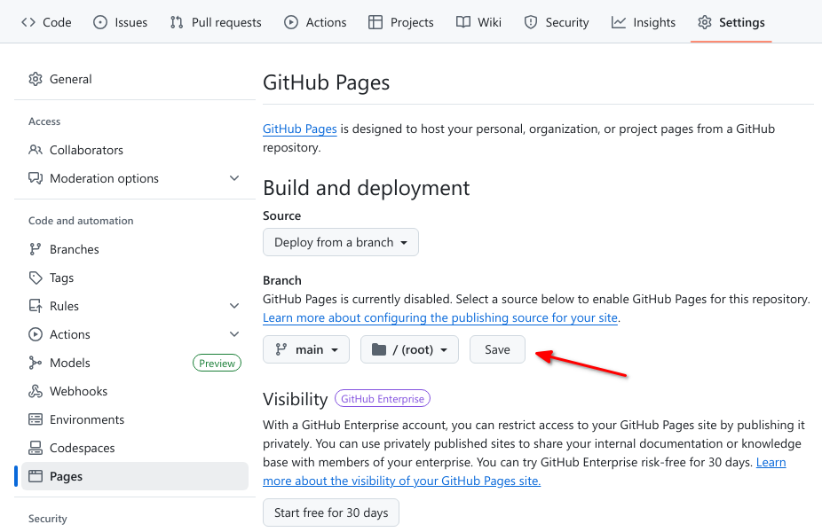

::::::::::::::::::::::::::::::::::::::: objectives

- create a GitHub Pages branch and push a file to it
- with a partner, experiment with collaborating on a GitHub Pages website
- apply the workflow between local and remote repositories to collaborate on a website

::::::::::::::::::::::::::::::::::::::::::::::::::

:::::::::::::::::::::::::::::::::::::::: questions

- What is GitHub Pages?
- How can I use GitHub Pages to collaborate and share my work?

::::::::::::::::::::::::::::::::::::::::::::::::::

## GitHub Pages

GitHub Pages is a service for publishing a website directly on GitHub from a Git repository.
You add some files and folders to a repository and GitHub Pages turns it into a website.
You can use HTML directly if you like, but they also provide Jekyll,
a tool that can build a blog or a template-based website from a set of Markdown files.

### Why GitHub Pages is awesome!

GitHub Pages allows you to version control your website. This is useful for a lot of different reasons. It allows you to
keep a record of what changes you have made. It allows people to reference your website at a particular point in time
and (if you make your source open) to see what it was like at that particular point in time. This is very useful for
academic citations. Most people have had the experience of following up a reference to a website and either getting a
404 error or seeing something completely different. Although using versions on your site doesn't guarantee this won't
happen, it does make it easier to manage old versions of your site.

GitHub Pages also mean that you can collaborate on a website with a lot of people without everyone having to
communicate endlessly back and forwards about what changes need to be made, or have been made already. You can create
'issues' (things that need discussing or fixing), list things to do in the future, and allow other people visiting your
website to quickly suggest, and help implement changes through pull requests.

### Enable GitHub Pages

GitHub Pages is turned off by default for all new repositories, and can be turned on in the settings menu for any repository.

Let's set up a new site by enabling GitHub Pages for our project.

Go to the Pages section of your repository's Settings:

{alt="GitHub repository's Pages settings"}

#### Source branch (required)

Pages needs to know the branch in your repository from which you want to serve your site. This can be any branch, including `main`.

Select then save the source branch:

{alt="GitHub Pages source branch menu"}

{alt="GitHub Pages source branch save"}

#### Theme (optional)

GitHub Pages provides different themes to visually style and organize your site's content. Choosing a theme is optional, and themes can be interchanged quickly.

{alt="GitHub Pages choose theme"}

See the [GitHub Pages documentation](https://docs.github.com/en/pages/getting-started-with-github-pages/adding-a-theme-to-your-github-pages-site-with-the-theme-chooser) for further information on using themes.

### View your site

If we now visit `https://some-librarian.github.io/hello-world/`,
we should see the contents of the index.md file that created earlier.
Usually it's available instantly, but it can take a few seconds and in the worst case a few minutes if GitHub are very busy.

:::::::::::::::::::::::::::::::::::::::: challenge

## Challenge: Contributing to a page owned by someone else (slightly easier way)

To practice using Git, GitHub pages and Markdown we can contribute to a GitHub pages site.
Pair up in groups of two (or more if needed) and do the exercises below together.

1. Go to [https://github.com/some-librarian/hello-world](https://github.com/some-librarian/hello-world), where "some-librarian" is the username of your exercise partner.

2. Click on "Fork" in the upper right part of the screen to create a copy of the repository on your account. Once you have a fork > of your partner's repository, you can edit the files in your own fork directly.

    {alt="GitHub fork button"}

3. Click the "index.md" file, then click the edit pencil icon:
  
    {alt="GitHub edit pencil"}

4. Now is good chance to try some Markdown syntax.
  Try some of the examples at [Mastering Markdown][].
  You can preview how it will look before you commit changes.

5. Once you are ready to commit, enter a short commit message,
  select "Create a new branch for this commit and start a pull request"
  and press "Propose changes" to avoid commiting directly to the main branch.
  
    {alt="Commit and create pull request"}

6. You can now go to the repository on your account and click "New Pull Request" button,
  where you can select base branches repositories, review the changes and add an additional
  explanation before sending the pull request (this is especially useful
  if you make a single pull request for multiple commits).

7. Your partner should now see a pull request under the "Pull requests" tab
  and can accept ("Merge pull request") the changes there. Try this.

This whole process of making a fork and a pull request might seem a bit cumbersome.
Try to think of why it was needed? And why it's called "pull request"?

[Mastering Markdown]: https://guides.github.com/features/mastering-markdown/

:::::::::::::::  solution

## Solution

We made a fork and a pull request because we did not have permission to edit
(or commit) the repository directly. A fork is a copy of the repository that
we *can* edit. By making a pull request we ask the owner of the repository if
they would like to accept (pull in) the changes from our fork (our copy) into
their version. The owner can then review the changes and choose to accept or
reject them.

You can open pull requests on any repository you find on GitHub. If you are a
group of people who plan to collaborate closely, on the other hand,
it's more practical to grant everyone access to commit directly instead.

:::::::::::::::::::::::::

::::::::::::::::::::::::::::::::::::::::::::::::::

:::::::::::::::::::::::::::::::::::::::: challenge

## Optional challenge: Contributing to a page owned by someone else (slightly more complicated way)

Instead of making edits on the GitHub website
you can 'clone' the fork to your local machine and work there.
There are several reasons why you might want to do this:

- you need to move content from one file to another;
- you need to make changes to several files at once;
- you find it easier to work in your desktop software than in a web form.

Pair up in groups of two (or more if needed) and follow the steps below together.
If you have already tackled the previous challenge,
you can use the fork you created there and skip to step 3.

1. Go to [https://github.com/some-librarian/hello-world](https://github.com/some-librarian/hello-world),
  where "some-librarian" is the username of your exercise partner.

2. Click on "Fork" in the upper right part of the screen
  to create a copy of that repository on your account.
  As you already have your own `hello-world` repository,
  you will need to use a different name for it, such as `hello-world-1`.

3. In your own fork, click on the "Code" button in the upper right part of the screen
  and copy a link to your repository.
  Just like when you [connected your local repository to GitHub][ep3-connecting],
  make sure "SSH" is selected, so the link starts with `git@github.com:`.

    {alt="GitHub code button and clone method selection"}

4. Go back to your shell terminal window.
  If you're in your own Git repository, use the `cd` command
  to come out of it:

    ```bash
    # To check where you are:
    $ pwd
    # To go up one directory:
    $ cd ..
    ```

    Change the following command to use the link you just copied
    and run it:

    ```bash
    $ git clone git@github.com:<your_github_username>/hello-world-1.git
    ```

    The `clone` command creates a directory on your computer containing
    the current state of the repository and its full version history.

5. Enter the directory that Git just created:

    ```bash
    $ cd hello-world-1
    ```

6. Create a new branch to hold the changes you're about to make:

    ```bash
    $ git switch -c my-patch-1
    ```

    Here, `switch` tells Git to change the current branch,
    the `-c` tells Git you want to create a new branch,
    and `my-patch-1` is what it will be called.

7. Open up the `index.md` and start editing it.
  You could try some more examples from [Mastering Markdown][].

8. After saving the file, add it, commit it with a short message describing the change:

    ```bash
    $ git add index.md
    $ git commit -m "Add more Markdown examples"
    ```

9. Push your new branch up to your fork on GitHub:

    ```bash
    $ git push origin my-patch-1
    ```

10. Git will show you a message from GitHub containing a link
  for starting a new pull request:

    ```output
    remote:
    remote: Create a pull request for 'my-patch-1' on GitHub by visiting:
    remote:      https://github.com/<your_github_username>/hello-world-1/pull/new/my-patch-1
    remote:
    ```

    You can visit that link in your browser, but if you go back to your fork in GitHib
    you will also see a button has appeared that says "Compare & pull request".
    You can click on that button instead if you prefer.

    {alt="GitHub compare and pull request button"}

11. The next screen lets you add a description to explain your changes to the repository owner,
  and change the title to make it clearer
  (this is especially useful if you make a single pull request for multiple commits).
  When you're ready, click on the "Create pull request" button.

12. Your partner should now see a pull request under the "Pull requests" tab
  and can accept ("Merge pull request") the changes there. Try this.

[ep3-connecting]: 03-sharing.html#connecting-your-local-repository-to-the-github-repository

::::::::::::::::::::::::::::::::::::::::::::::::::

:::::::::::::::::::::::::::::::::::::::: challenge

## Optional challenge: Adding an HTML page

GitHub Pages is not limited to Markdown. If you know some HTML, try adding an HTML page
to your repository. You could do this on the command line or directly on GitHub. The
steps below are for working directly on GitHub:

1. To add a new file directly on GitHub, press the "Create new file" button.
  
    {alt="Create new file on GitHub"}

2. Name it 'test.html', add some HTML and click "Commit new file".

3. Try opening `https://some-librarian.github.io/hello-world/test`
  (replace "some-librarian" with your username).
  Notice that the HTML extension is not included.

::::::::::::::::::::::::::::::::::::::::::::::::::

:::::::::::::::::::::::::::::::::::::::: keypoints

- GitHub Pages offer an automated way to create a website that is version controlled and accessible for collaboration
- Collaborating on a GitHub Pages website uses the same Git/GitHub workflow you learned for collaborating via a GitHub repository

::::::::::::::::::::::::::::::::::::::::::::::::::


